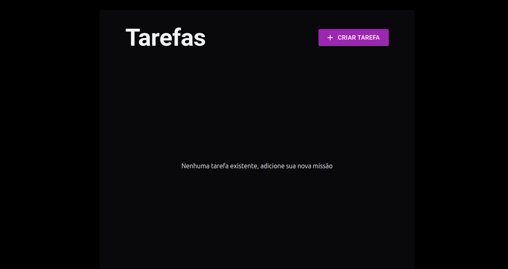
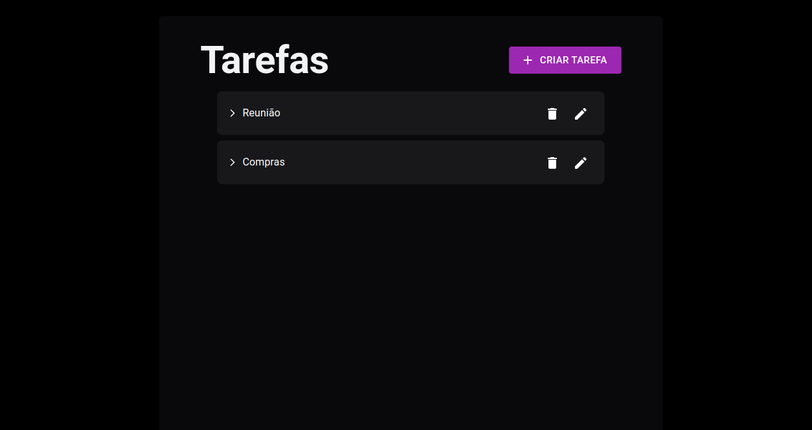
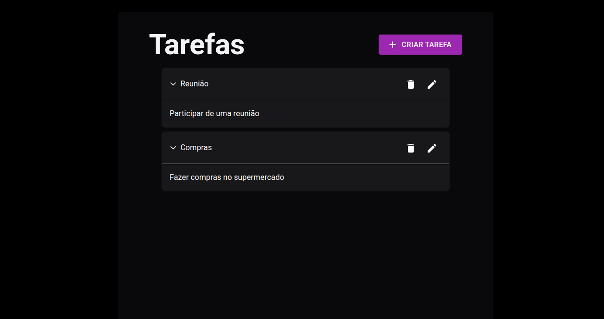
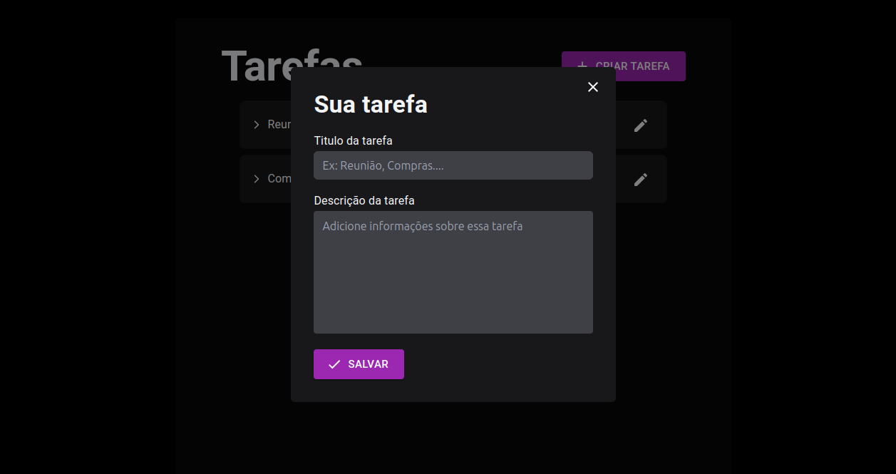

<h1 align="center">Gestão de tarefas</h1>


## 📖 Sobre o Projeto 
Este projeto trata-se de uma aplicação de gerenciamento de tarefas. A aplicação consiste em um front-end em React.js e um back-end em Node.js, TypeScript, Banco de Dados Firebase e Express. A aplicação é capaz de criar, atualizar e excluir tarefas. As tarefas possuem um título e uma descrição. O back-end deve é responsável por armazenar as tarefas em um banco de dados e disponibilizá-las para o front-end.

## 💻 Front-end
* Typescript
* React
* Vite
* Material-UI
* Tailwindcss
* react-router-dom






## ⚙️ Backend
* Typescript
* Nodejs
* Express
* Firebase
* Zod

## 🚀 Como executar o projeto
Pré-requisitos: Node 18 ou superior e Git
```
# clonar repositório
git clone https://github.com/YuriMont/challengetask

# entrar na pasta do projeto
cd challengetask

# executar o comando na pasta server
npm run dev

# executar o comando na pasta web
npm run dev
```


